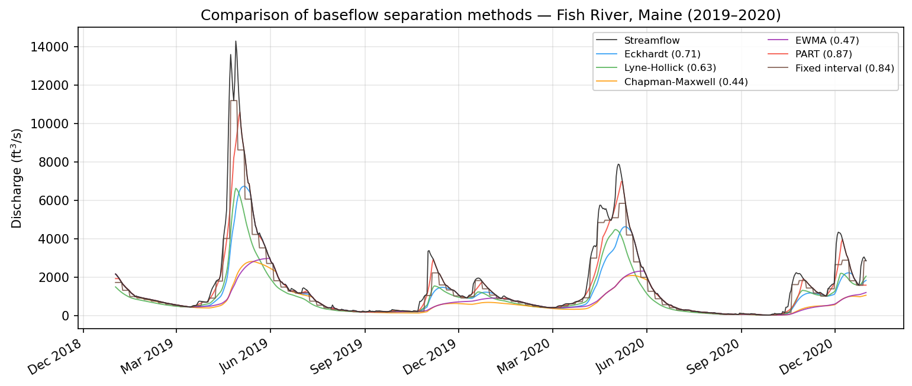

# baseflowx

**baseflowx** is a comprehensive Python toolkit for baseflow separation from streamflow hydrographs. It implements 17 separation methods spanning four paradigms, unified under a common API. Whether you need a quick Eckhardt filter for a single gauge or a systematic multi-method comparison across hundreds of sites, baseflowx provides the tools to get there with minimal boilerplate.

```bash
pip install baseflowx
```

!!! tip "Try it in the browser"
    **[Baseflow Explorer](https://baseflow-explorer.onrender.com)** is a companion web app that runs every separation method against any USGS gage — no Python install needed. Pick a gage from the map, tweak parameters, and compare methods side by side. [More about the app →](webapp.md)



## Quick start

baseflowx ships with a bundled sample dataset (USGS site 01013500, Fish River near Fort Kent, Maine, 2019--2020) so you can begin experimenting immediately:

```python
import baseflowx

# Load the bundled sample data
data = baseflowx.load_sample_data()
Q = data['Q']

# Estimate the recession coefficient from the hydrograph
strict = baseflowx.strict_baseflow(Q)
a = baseflowx.recession_coefficient(Q, strict)

# Run the Eckhardt filter
b = baseflowx.eckhardt(Q, a, BFImax=0.8)
```

You can also fetch your own data directly from the USGS National Water Information System:

```python
from baseflowx.io import fetch_usgs

data = fetch_usgs('01013500', '2019-01-01', '2020-12-31')
Q = data['values']
```

## The four paradigms

All recursive digital filters in baseflowx share a generalized core equation:

$$b_t = \alpha \, b_{t-1} + \beta \left( Q_t + \gamma \, Q_{t-1} \right)$$

with the constraint \(b_t \leq Q_t\). The choice of \(\gamma\) defines two structural families, and the remaining paradigms move beyond filtering entirely.

**Recursive digital filters (\(\gamma = 0\))** are derived from linear reservoir theory. The current baseflow depends only on the previous baseflow and the current streamflow. This family includes the Boughton, Chapman-Maxwell, Eckhardt, EWMA, and Furey-Gupta filters, as well as the WHAT method (which is mathematically identical to Eckhardt). These methods are simple to apply, requiring only a recession coefficient and in some cases a second calibration parameter such as \(\text{BFI}_\text{max}\).

**Recursive digital filters (\(\gamma = 1\))** come from signal-processing roots. They incorporate both the current and previous streamflow in each update step, which provides additional smoothing. The Lyne-Hollick, Chapman (1991), and Willems filters belong to this family. The IHACRES filter generalizes further with a variable \(\gamma\), bridging the two families along a continuum.

**Graphical and recession-based methods** take a fundamentally different approach. Rather than filtering the entire hydrograph, they identify turning points or baseflow-dominated periods and interpolate between them. The three HYSEP methods (fixed interval, sliding interval, and local minimum) from Sloto & Crouse (1996), the UKIH smoothed minima method, and the PART recession-based method (Rutledge, 1998) all fall in this category. These methods are especially common in USGS practice.

**Tracer-based methods** use water-quality data -- specifically specific conductance -- as an independent constraint on the baseflow fraction. The Conductivity Mass Balance (CMB) method applies a two-component mixing model:

$$Q_b(t) = Q(t) \cdot \frac{SC(t) - SC_{RO}}{SC_{BF} - SC_{RO}}$$

where \(SC_{BF}\) and \(SC_{RO}\) are end-member conductivities for baseflow and runoff. baseflowx also provides a calibration bridge that uses CMB results to estimate Eckhardt's \(\text{BFI}_\text{max}\) parameter, connecting the tracer and filter paradigms.

## Background

baseflowx builds on the [baseflow](https://github.com/xiejx5/baseflow) package by Xie et al. (2020), which accompanied the paper "Evaluation of typical methods for baseflow separation in the contiguous United States" (Journal of Hydrology, 583, 124628). baseflowx extends that work with additional methods (PART, CMB, BFlow, IHACRES), a unified filter architecture, modern packaging, and USGS data integration.

This project is funded by [CIROH](https://ciroh.ua.edu/) (Cooperative Institute for Research to Operations in Hydrology).
