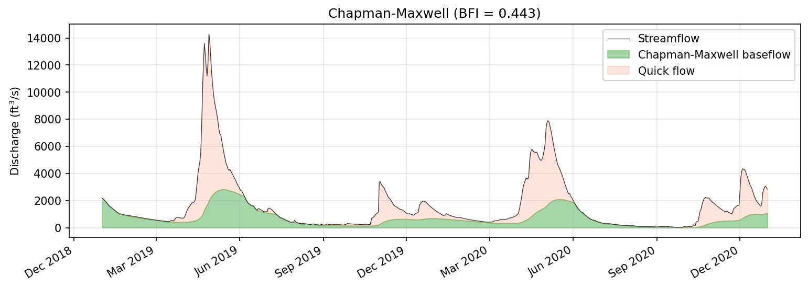
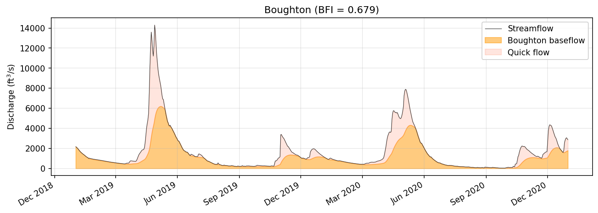
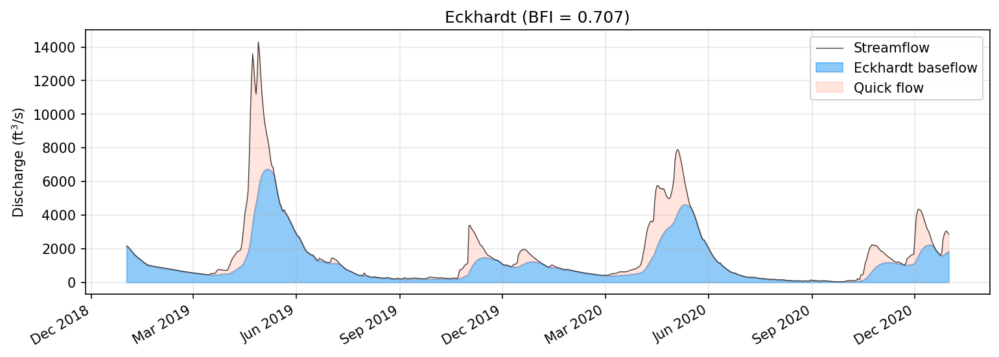
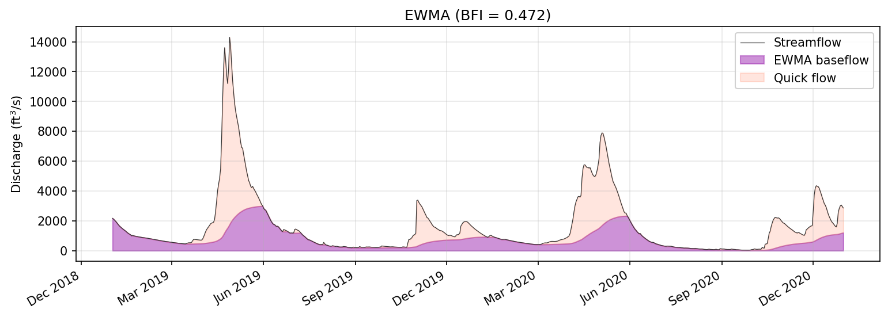
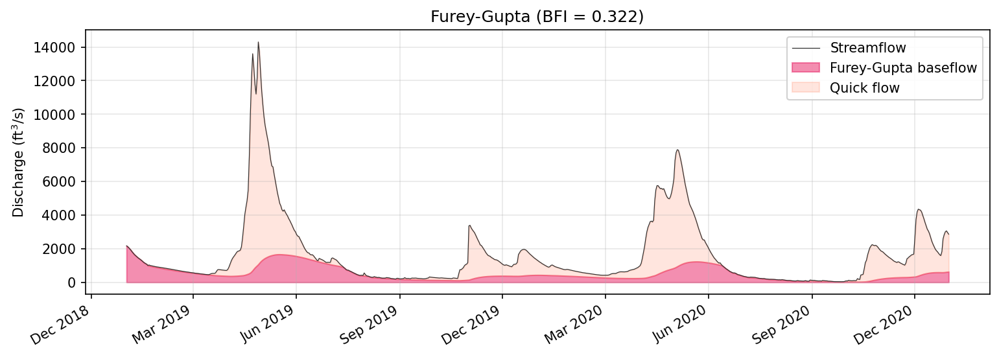
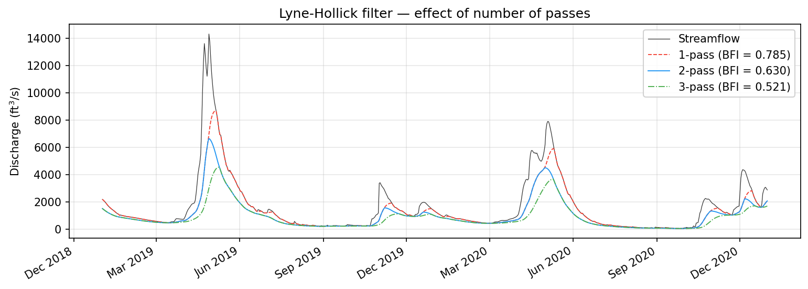
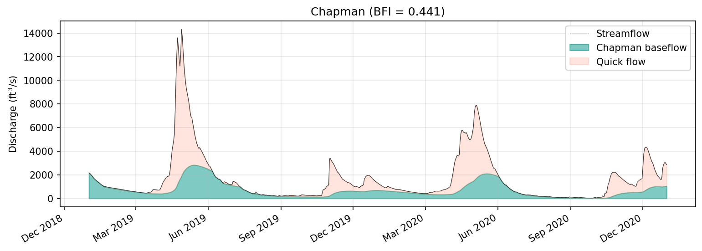
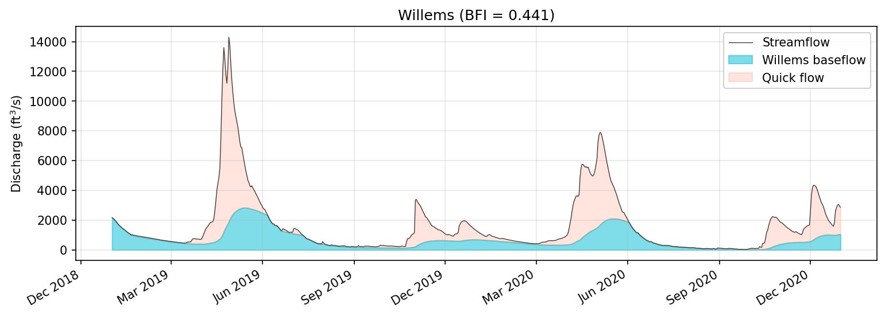
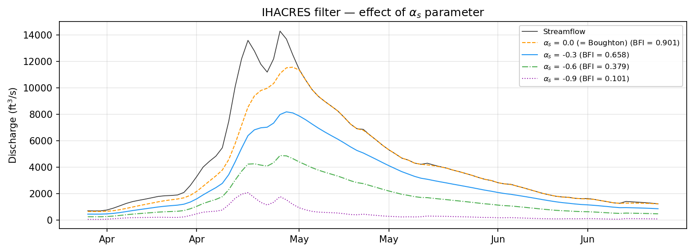

# Recursive Digital Filters

Recursive digital filters are the most widely used family of baseflow separation techniques in modern hydrology. They operate on a simple principle: at each timestep, the baseflow estimate is updated as a weighted combination of the previous baseflow and the current (and sometimes previous) streamflow. The result is a smooth baseflow signal extracted from a noisy hydrograph without any need for manual turning-point identification.

Eckhardt (2005) demonstrated that nearly all published recursive digital filters for baseflow separation can be expressed as special cases of a single generalized equation:

$$b_t = \alpha \cdot b_{t-1} + \beta \left( Q_t + \gamma \cdot Q_{t-1} \right)$$

subject to the physical constraint \(b_t \leq Q_t\), which ensures that baseflow never exceeds total streamflow. The three coefficients \(\alpha\), \(\beta\), and \(\gamma\) are derived from the specific assumptions of each filter, and the value of \(\gamma\) divides the filters into two structural families. In baseflowx, all of these filters are implemented through a shared computational core (`_recursive_digital_filter`), making the family relationships explicit in the code itself.


The distinction between the two families is not merely algebraic. Filters with \(\gamma = 0\) are grounded in linear reservoir theory: they assume that groundwater storage is proportional to baseflow discharge, and they derive the filter coefficients from the continuity equation applied to that storage. Filters with \(\gamma = 1\) originate from low-pass digital signal processing, where both the current and previous signal values enter the smoothing operation. A third category, represented by the IHACRES filter, uses a variable \(\gamma\) to move along the continuum between these two families.

---

## The \(\gamma = 0\) Family: Linear Reservoir Filters

The linear reservoir model posits that groundwater storage \(S\) is related to baseflow discharge \(b\) by a simple proportionality \(S = b / c\), where \(c\) is the recession constant. When this assumption is combined with the continuity equation \(dS/dt = R - b\) (where \(R\) is recharge), and the resulting differential equation is discretized over a daily timestep, the result is a recursive filter that depends only on the previous baseflow and the current streamflow -- that is, \(\gamma = 0\). The filters in this family differ only in how they parameterize \(\alpha\) and \(\beta\).

### Chapman-Maxwell (1996)

The Chapman-Maxwell filter was derived by Chapman and Maxwell (1996) as a direct discretization of the linear reservoir equation. It is the simplest two-state filter in the \(\gamma = 0\) family, requiring only the recession coefficient \(a\) as input. The filter coefficients are:

$$\alpha = \frac{a}{2 - a}, \qquad \beta = \frac{1 - a}{2 - a}$$

yielding the recursion:

$$b_t = \frac{a}{2 - a} \, b_{t-1} + \frac{1 - a}{2 - a} \, Q_t$$

Chapman and Maxwell showed that this formulation is equivalent to a trapezoidal-rule discretization of the linear reservoir, making it exact for exponentially declining recessions. As discussed below, this filter is mathematically identical to the Eckhardt filter with \(\text{BFI}_\text{max} = 0.5\), which means it implicitly assumes that baseflow constitutes at most half of total streamflow -- an assumption that is reasonable for flashy catchments but too restrictive for many groundwater-dominated systems.

```python
import baseflowx

data = baseflowx.load_sample_data()
Q = data['Q']

strict = baseflowx.strict_baseflow(Q)
a = baseflowx.recession_coefficient(Q, strict)

b = baseflowx.chapman_maxwell(Q, a)
```



**Reference:** Chapman, T.G. and Maxwell, A.I. (1996). Baseflow separation -- comparison of numerical methods with tracer experiments. *Hydrol. Water Resour. Symp.*, Inst. Eng. Australia, Hobart, 539--545.

### Boughton (1993)

Boughton (1993) introduced a two-parameter filter that adds a calibration parameter \(C\) controlling the fraction of streamflow attributed to baseflow recharge. The coefficients are:

$$\alpha = \frac{a}{1 + C}, \qquad \beta = \frac{C}{1 + C}$$

and the recursion is:

$$b_t = \frac{a}{1 + C} \, b_{t-1} + \frac{C}{1 + C} \, Q_t$$

The parameter \(C\) governs the responsiveness of the baseflow signal to changes in streamflow. Small values of \(C\) produce a heavily smoothed baseflow that responds sluggishly to recharge events; large values allow baseflow to track streamflow more closely. This filter is a reparameterization of the Eckhardt filter, with the relationship \(C = (1 - a) \cdot \text{BFI}_\text{max} / (1 - \text{BFI}_\text{max})\). In practice, \(C\) is typically calibrated against independent estimates of the baseflow index, such as those derived from tracer data.

```python
b = baseflowx.boughton(Q, a, C=0.05)
```



**Reference:** Boughton, W.C. (1993). A hydrograph-based model for estimating water yield of ungauged catchments. *Inst. Eng. Aust. Natl. Conf. Publ.* 93/14, 317--324.

### Eckhardt (2005)

The Eckhardt filter is the most general two-parameter filter in the \(\gamma = 0\) family and has become one of the most widely cited baseflow separation methods in the literature. Eckhardt (2005) derived the filter by requiring that the long-term baseflow index converge to a prescribed maximum value \(\text{BFI}_\text{max}\) under steady-state conditions. The coefficients are:

$$\alpha = \frac{(1 - \text{BFI}_\text{max}) \cdot a}{1 - a \cdot \text{BFI}_\text{max}}, \qquad \beta = \frac{(1 - a) \cdot \text{BFI}_\text{max}}{1 - a \cdot \text{BFI}_\text{max}}$$

and the full recursion, commonly written with the denominator made explicit, is:

$$b_t = \frac{(1 - \text{BFI}_\text{max}) \cdot a \cdot b_{t-1} + (1 - a) \cdot \text{BFI}_\text{max} \cdot Q_t}{1 - a \cdot \text{BFI}_\text{max}}$$

The \(\text{BFI}_\text{max}\) parameter encodes prior knowledge about the hydrogeological setting of the catchment. Eckhardt (2005) suggested default values of 0.80 for perennial streams with porous aquifers, 0.50 for ephemeral streams with porous aquifers, and 0.25 for perennial streams with hard-rock aquifers. In practice, \(\text{BFI}_\text{max}\) is often calibrated using tracer-derived baseflow estimates or optimized to match recession behavior (see the [CMB Calibration Bridge](../guides/cmb-calibration.md) and [Parameter Estimation](../guides/parameter-estimation.md) guides).

The Eckhardt filter subsumes the Chapman-Maxwell filter as the special case \(\text{BFI}_\text{max} = 0.5\), and it is algebraically equivalent to the Boughton filter under the substitution \(C = (1 - a) \cdot \text{BFI}_\text{max} / (1 - \text{BFI}_\text{max})\). These relationships are not mere curiosities; they mean that any result obtained with Chapman-Maxwell or Boughton can be reproduced exactly with the appropriate Eckhardt parameterization.

```python
b = baseflowx.eckhardt(Q, a, BFImax=0.8)
```



**Reference:** Eckhardt, K. (2005). How to construct recursive digital filters for baseflow separation. *Hydrological Processes*, 19, 507--515.

### EWMA / Tularam-Ilahee (2008)

The exponentially weighted moving average (EWMA) filter was proposed by Tularam and Ilahee (2008) as a smoothing approach to baseflow separation. It uses a single parameter \(e\) that controls the degree of exponential smoothing:

$$\alpha = 1 - e, \qquad \beta = e$$

giving the recursion:

$$b_t = (1 - e) \cdot b_{t-1} + e \cdot Q_t$$

The EWMA filter is conceptually straightforward: each baseflow estimate is a weighted average of the previous baseflow and the current streamflow, with \(e\) controlling how rapidly new information is incorporated. Small values of \(e\) (e.g., 0.001--0.01) produce a very smooth, slowly varying baseflow signal, while larger values allow more rapid response. Unlike most other filters in this family, the EWMA does not have an explicit physical derivation from the linear reservoir model, but its mathematical form is consistent with the general framework. The parameter \(e\) is related to the recession constant, though the mapping is not as direct as for Eckhardt or Chapman-Maxwell.

```python
b = baseflowx.ewma(Q, e=0.01)
```



**Reference:** Tularam, G.A. and Ilahee, M. (2008). Exponential smoothing method of base flow separation and its impact on continuous loss estimates. *American Journal of Environmental Sciences*, 4(2), 136--144.

### Furey-Gupta (2001)

The Furey-Gupta filter stands apart from the other \(\gamma = 0\) filters because it is derived from a physically based model of subsurface flow rather than from simple reservoir assumptions. Furey and Gupta (2001) developed the filter from a linearized Boussinesq equation, and the resulting recursion uses the *previous* timestep's streamflow \(Q_{t-1}\) rather than the current value \(Q_t\):

$$b_t = \left(a - A(1-a)\right) \cdot b_{t-1} + A(1-a) \cdot Q_{t-1}$$

The parameter \(A\) represents the fraction of aquifer discharge that reaches the stream within one timestep. This lagged dependence on \(Q_{t-1}\) reflects the physical reality that groundwater recharge from a storm event does not instantaneously appear as baseflow; there is a finite travel time through the subsurface. Because of this lagged structure, the Furey-Gupta filter does not fit exactly into the standard general form and is implemented with its own recursion loop in baseflowx.

```python
b = baseflowx.furey(Q, a, A=0.5)
```



**Reference:** Furey, P.R. and Gupta, V.K. (2001). A physically based filter for separating base flow from streamflow time series. *Water Resources Research*, 37(11), 2709--2722.

### WHAT (Lim et al., 2005)

The Web-based Hydrograph Analysis Tool (WHAT) method, introduced by Lim et al. (2005), is mathematically identical to the Eckhardt filter. It was developed as part of an automated web-based system for hydrograph analysis and uses the same two parameters (\(a\) and \(\text{BFI}_\text{max}\)). In baseflowx, `what()` is provided as a convenience alias for `eckhardt()` to maintain compatibility with the WHAT naming convention used in some literature. Note that the argument order differs: `what(Q, BFImax, a)` versus `eckhardt(Q, a, BFImax)`.

```python
# These two calls produce identical results
b1 = baseflowx.eckhardt(Q, a, BFImax=0.8)
b2 = baseflowx.what(Q, BFImax=0.8, a=a)
```

**Reference:** Lim, K.J., Engel, B.A., Tang, Z., Choi, J., Kim, K., Muthukrishnan, S., and Tripathy, D. (2005). Automated web GIS based hydrograph analysis tool, WHAT. *Journal of the American Water Resources Association*, 41(6), 1407--1416.

---

## The \(\gamma = 1\) Family: Signal Processing Filters

The second family of recursive digital filters originates not from groundwater hydraulics but from signal processing theory. In this framework, the streamflow hydrograph is treated as a composite signal containing low-frequency (baseflow) and high-frequency (quickflow) components. The filter is designed to extract the low-frequency component by applying a recursive low-pass operator. The distinguishing feature of these filters is that they incorporate both the current and previous streamflow in each update step (\(\gamma = 1\)), providing a symmetric smoothing window centered between adjacent timesteps.

### Lyne-Hollick (1979)

The Lyne-Hollick filter is the oldest and most widely used recursive digital filter for baseflow separation. Originally proposed by Lyne and Hollick (1979) and later popularized by Nathan and McMahon (1990), it was adapted directly from signal processing theory. The filter coefficients are:

$$\alpha = \beta_p, \qquad \beta = \frac{1 - \beta_p}{2}$$

where \(\beta_p\) is the filter parameter (confusingly named "beta" in the original literature; baseflowx uses the variable name `beta` to match convention). The recursion is:

$$b_t = \beta_p \cdot b_{t-1} + \frac{1 - \beta_p}{2} \left( Q_t + Q_{t-1} \right)$$

Nathan and McMahon (1990) recommended a default value of \(\beta_p = 0.925\) based on comparison with manual baseflow separation and tracer experiments. They also established the practice of applying the filter in multiple passes -- alternating forward and backward through the record -- to achieve greater smoothing. A single forward pass tends to overestimate baseflow on the rising limb and underestimate it on the falling limb; the backward pass compensates for this asymmetry.

In baseflowx, `lh()` applies the standard two-pass (forward + backward) implementation, while `lh_multi()` allows a configurable number of passes. The three-pass protocol (\(n = 3\)) has become a *de facto* standard in Australian hydrology and is used internally by the BFlow method.

```python
# Standard 2-pass Lyne-Hollick
b_2pass = baseflowx.lh(Q, beta=0.925)

# Configurable n-pass variant
b_1pass = baseflowx.lh_multi(Q, beta=0.925, num_pass=1)
b_3pass = baseflowx.lh_multi(Q, beta=0.925, num_pass=3)
```



Each additional pass further attenuates the high-frequency content of the baseflow signal, producing a smoother and lower baseflow estimate. The choice of number of passes is a modeling decision that depends on the application: fewer passes preserve more of the baseflow variability, while more passes produce a more conservative (lower) estimate of the baseflow contribution.

**References:**

- Lyne, V. and Hollick, M. (1979). Stochastic time-variable rainfall-runoff modelling. *Inst. Eng. Aust. Natl. Conf.*, 89--93.
- Nathan, R.J. and McMahon, T.A. (1990). Evaluation of automated techniques for base flow and recession analyses. *Water Resources Research*, 26(7), 1465--1473.
- Spongberg, M.E. (2000). Spectral analysis of base flow separation with digital filters. *Water Resources Research*, 36(3), 745--752.

### Chapman (1991)

Chapman (1991) derived a filter that combines the linear reservoir assumption with the symmetric differencing scheme used in signal processing filters. The resulting coefficients are:

$$\alpha = \frac{3a - 1}{3 - a}, \qquad \beta = \frac{1 - a}{3 - a}$$

and the recursion is:

$$b_t = \frac{3a - 1}{3 - a} \, b_{t-1} + \frac{1 - a}{3 - a} \left( Q_t + Q_{t-1} \right)$$

This filter occupies an interesting position in the taxonomy: it uses the recession coefficient \(a\) (a physical parameter from the linear reservoir model) but applies it within a \(\gamma = 1\) structure (a signal processing form). Chapman demonstrated that this formulation provides a better approximation to the analytical solution of the linear reservoir differential equation than the simpler Chapman-Maxwell form when the recession is not purely exponential. The filter requires \(a > 1/3\) for \(\alpha\) to remain positive, a condition that is easily satisfied for typical recession coefficients (which range from 0.9 to 0.999 for daily streamflow).

```python
b = baseflowx.chapman(Q, a)
```



**Reference:** Chapman, T.G. (1991). Comment on "Evaluation of automated techniques for base flow and recession analyses" by R.J. Nathan and T.A. McMahon. *Water Resources Research*, 27(7), 1783--1784.

### Willems (2009)

Willems (2009) proposed a digital filter that parameterizes the separation in terms of the average proportion of quickflow \(w\) in total streamflow, rather than using the recession coefficient directly. The filter first computes an intermediate quantity:

$$v = \frac{(1 - w)(1 - a)}{2w}$$

and then the recursion coefficients are:

$$\alpha = \frac{a - v}{1 + v}, \qquad \beta = \frac{v}{1 + v}$$

giving:

$$b_t = \frac{a - v}{1 + v} \, b_{t-1} + \frac{v}{1 + v} \left( Q_t + Q_{t-1} \right)$$

The parameter \(w\) has an intuitive physical interpretation as the fraction of total streamflow that arrives as quickflow (i.e., \(w = 1 - \text{BFI}\) in steady state). This makes the filter particularly convenient when prior estimates of the baseflow index are available from regional regression or tracer studies. Willems developed the filter as part of a broader time series analysis toolkit for evaluating rainfall-runoff model performance.

```python
b = baseflowx.willems(Q, a, w=0.5)
```



**Reference:** Willems, P. (2009). A time series tool to support the multi-criteria performance evaluation of rainfall-runoff models. *Environmental Modelling & Software*, 24(3), 311--321.

---

## Variable \(\gamma\): The IHACRES Bridge

### IHACRES / Jakeman-Hornberger (1993)

The IHACRES filter, derived from the Jakeman-Hornberger rainfall-runoff model (Jakeman and Hornberger, 1993), is a three-parameter filter that generalizes the Boughton filter by introducing a dependence on the previous timestep's streamflow through the parameter \(\alpha_s\). Its coefficients in the general framework are:

$$\alpha = \frac{a}{1 + C}, \qquad \beta = \frac{C}{1 + C}, \qquad \gamma = \alpha_s$$

and the recursion is:

$$b_t = \frac{a}{1 + C} \, b_{t-1} + \frac{C}{1 + C} \left( Q_t + \alpha_s \cdot Q_{t-1} \right)$$

The \(\alpha_s\) parameter governs the degree to which baseflow responds to the previous day's total streamflow, and it typically takes values between \(-0.99\) and \(0\). When \(\alpha_s = 0\), the IHACRES filter reduces exactly to the Boughton filter (a \(\gamma = 0\) method). As \(\alpha_s\) moves toward \(-1\), the filter incorporates progressively more information from the previous timestep, approaching the behavior of the \(\gamma = 1\) family. In this sense, the IHACRES filter is not merely another method but a unifying link between the two structural families, demonstrating that the distinction between "linear reservoir" and "signal processing" filters is one of degree rather than kind.

The \(\alpha_s\) parameter has a physical interpretation within the IHACRES model: it characterizes the slow-flow component of the unit hydrograph, controlling how quickly the catchment's baseflow response decays after a recharge event. Negative values reflect the typical situation where the contribution of previous-day streamflow to current baseflow is attenuated (i.e., the slow-flow recession is monotonically decreasing).

```python
b = baseflowx.ihacres(Q, a, C=0.3, alpha_s=-0.5)
```



**Reference:** Jakeman, A.J. and Hornberger, G.M. (1993). How much complexity is warranted in a rainfall-runoff model? *Water Resources Research*, 29(8), 2637--2649.

---

## Relationships Among the Filters

The filters described above are not independent methods but members of an interconnected family. Understanding their relationships is important both for interpreting results and for making informed choices about which filter to apply.

The most fundamental relationship is between the Eckhardt, Chapman-Maxwell, and Boughton filters. Chapman-Maxwell is Eckhardt with \(\text{BFI}_\text{max} = 0.5\), and Boughton is a reparameterization of Eckhardt with:

$$C = \frac{(1 - a) \cdot \text{BFI}_\text{max}}{1 - \text{BFI}_\text{max}}$$

This means that any Boughton result can be reproduced by Eckhardt with the appropriate \(\text{BFI}_\text{max}\), and vice versa. The WHAT method is identical to Eckhardt and adds no new mathematical content.

The IHACRES filter extends this picture by adding \(\alpha_s\) as a third parameter. At \(\alpha_s = 0\), IHACRES collapses to Boughton (and, by extension, to the Eckhardt family). As \(\alpha_s\) moves away from zero, the filter departs from the \(\gamma = 0\) family and begins to incorporate the symmetric smoothing characteristic of the \(\gamma = 1\) filters. This provides a continuous path between what might otherwise appear to be two distinct filter paradigms.

Within the \(\gamma = 1\) family, the Lyne-Hollick filter is the simplest and most empirical, parameterized by a single smoothing constant without direct reference to the recession coefficient. The Chapman (1991) filter reintroduces the recession coefficient into the \(\gamma = 1\) framework, providing a physical anchor. The Willems filter offers an alternative parameterization in terms of the quickflow fraction, which can be more intuitive for calibration purposes.

For practical applications, the choice among filters often matters less than the choice of parameter values. When the recession coefficient \(a\) and an appropriate second parameter (whether \(\text{BFI}_\text{max}\), \(C\), or \(w\)) are well-constrained by independent data, most filters in the same family will produce broadly similar results. The greatest sensitivity is typically to \(\text{BFI}_\text{max}\) (or its equivalents), which directly controls the overall magnitude of the baseflow signal. The [Parameter Estimation](../guides/parameter-estimation.md) guide discusses strategies for constraining these parameters, and the [CMB Calibration Bridge](../guides/cmb-calibration.md) guide shows how tracer data can provide independent estimates of \(\text{BFI}_\text{max}\).
