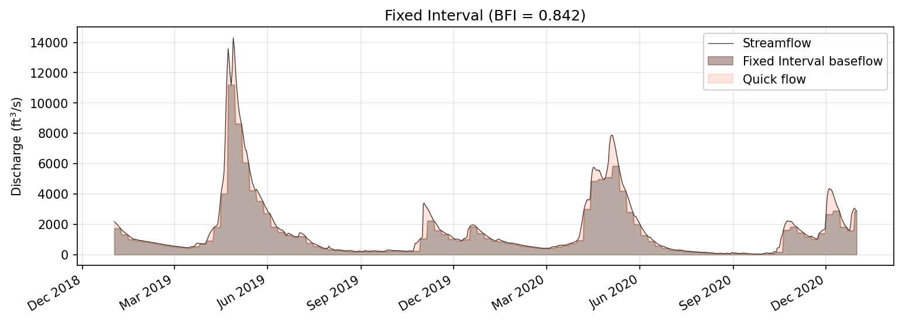
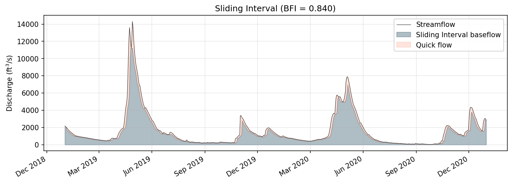
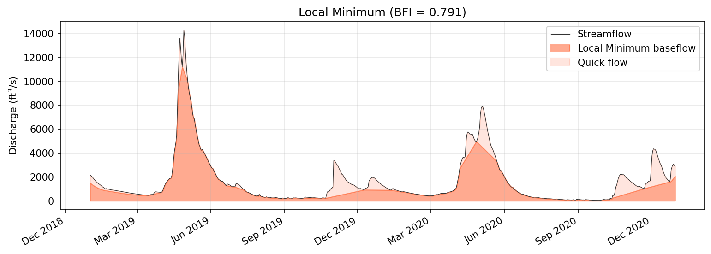
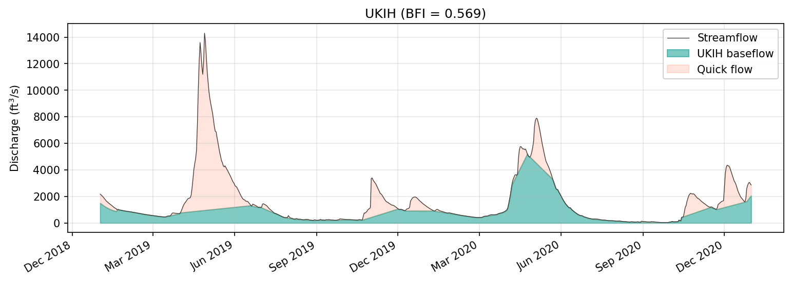
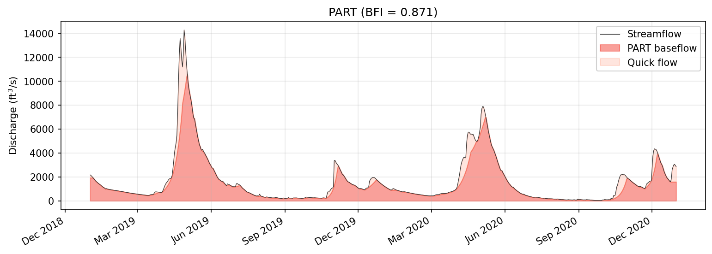

# Graphical and Recession-Based Methods

The graphical and recession-based methods in baseflowx take a fundamentally different approach from recursive digital filters. Rather than processing every timestep through a difference equation, these methods identify characteristic points in the hydrograph---local minima, turning points, or days where streamflow is entirely groundwater discharge---and construct the baseflow signal by interpolating between them. This family of methods has a long history in USGS practice and remains widely used for groundwater recharge estimation and low-flow analysis.

Five methods fall under this heading: the three HYSEP methods of Sloto and Crouse (1996), the UK Institute of Hydrology smoothed minima method (UKIH, 1980), and the PART recession-based method of Rutledge (1998). Each relies on the concept that baseflow varies slowly relative to surface runoff, so that the lower envelope of the hydrograph---or a carefully selected subset of it---approximates the groundwater discharge signal.

---

## The HYSEP Interval

All three HYSEP methods share a common parameter: the separation interval \(2N^*\), derived from drainage area. The duration of surface runoff following a storm is empirically related to basin area by

$$
N = A^{0.2}
$$

where \(A\) is the drainage area in square miles. Because baseflowx accepts area in km², the conversion \(A_{\text{mi}^2} = 0.3861 \, A_{\text{km}^2}\) is applied internally. The interval \(2N^*\) is defined as the odd integer between 3 and 11 nearest to \(2N\). This constraint ensures the window is always symmetric (odd) and bounded within a physically reasonable range. If no area is supplied, the default \(N = 5\) (i.e., \(2N^* = 9\)) is used.

The rationale for the \(A^{0.2}\) relationship is that larger basins have longer routing times, so surface runoff persists for more days after a storm. Capping the interval at 11 days prevents excessive smoothing in very large basins where the power-law relationship begins to break down.

---

## Fixed Interval

**Function:** `fixed(Q, area)`

The fixed interval method is the simplest of the three HYSEP algorithms. It divides the streamflow record into non-overlapping blocks of \(2N^*\) consecutive days. Within each block, the minimum streamflow value is identified and assigned as the baseflow for every day in that block. The result is a step function that jumps at block boundaries.

Because the blocks do not overlap, the method is computationally efficient and trivially parallelizable. However, the hard block boundaries can produce discontinuities---baseflow may jump abruptly between adjacent blocks if their minima differ substantially. This artifact is an inherent limitation of the non-overlapping design. In practice, it matters most during rapid recession limbs that happen to straddle a block boundary.

If the record length is not an exact multiple of \(2N^*\), the final partial block is treated separately: its minimum is assigned to the remaining days.

---

## Sliding Interval

**Function:** `slide(Q, area)`

The sliding interval method addresses the discontinuity problem of the fixed interval approach by using a moving window instead of discrete blocks. A window of width \(2N^*\) days is centered on each day \(t\), and the minimum streamflow within that window is assigned as the baseflow for day \(t\). As the window slides forward one day at a time, the baseflow signal becomes a smooth, continuous curve that tracks the lower envelope of the hydrograph.

Formally, for each day \(t\):

$$
b_t = \min_{j \in [t - (N^*-1)/2, \; t + (N^*-1)/2]} Q_j
$$

At the edges of the record---where the full window cannot be centered---the method uses a truncated window extending to the boundary. The minimum of this shorter segment is assigned to the affected days.

The sliding interval generally produces a smoother baseflow signal than the fixed interval method and avoids the staircase artifacts, at the cost of modestly higher computation. Because the window is symmetric, it does not introduce any phase shift relative to the hydrograph.

---

## Local Minimum

**Function:** `local(Q, b_LH, area)`

The local minimum method combines the windowed search of the HYSEP framework with linear interpolation, producing a baseflow curve that is both smooth and more responsive to hydrograph structure than the sliding interval approach. The algorithm proceeds in two stages.

First, it identifies local minima by scanning the streamflow record with a window of width \(2N^*\). A day qualifies as a local minimum if its streamflow is the smallest value within the window centered on it. This yields a sparse set of turning points distributed along the hydrograph at intervals dictated by basin size.

Second, baseflow is constructed by linear interpolation between consecutive turning points. At each turning point, baseflow equals the observed streamflow. Between turning points, baseflow increases or decreases linearly. At any day where the interpolated value would exceed the observed streamflow, baseflow is capped at the streamflow value---enforcing the physical constraint that baseflow cannot exceed total flow.

The edge regions of the record (before the first turning point and after the last) cannot be handled by interpolation because no bounding turning points exist. In these regions, baseflowx substitutes the Lyne-Hollick digital filter baseflow, passed in as the `b_LH` parameter. This hybrid approach avoids undefined values at the boundaries while preserving the graphical character of the method across the interior of the record.

---

## UKIH Smoothed Minima

**Function:** `ukih(Q, b_LH)`

The UK Institute of Hydrology smoothed minima method (UKIH, 1980) predates the HYSEP methods and uses a different strategy for selecting turning points. Rather than a sliding window parameterized by drainage area, it applies a fixed 5-day block structure combined with a statistical turning point test.

The algorithm divides the streamflow record into non-overlapping blocks of 5 consecutive days and identifies the minimum streamflow in each block. These block minima form a candidate set of turning points. Not all candidates are retained: a block minimum at position \(i\) is accepted as a true turning point only if it passes the condition

$$
0.9 \, Q_{\min,i} < Q_{\min,i-1} \quad \text{and} \quad 0.9 \, Q_{\min,i} < Q_{\min,i+1}
$$

where \(Q_{\min,i-1}\) and \(Q_{\min,i+1}\) are the block minima of the adjacent blocks. The 0.9 multiplier introduces a tolerance that prevents shallow local minima on the recession limb from being mistakenly identified as turning points. Only genuine valleys---points that are meaningfully lower than their neighbors---survive this test.

Once the turning points are established, baseflow is computed by linear interpolation between them, with the same cap at observed streamflow used in the local minimum method. As with the HYSEP local minimum method, edge regions before the first and after the last turning point are filled using the Lyne-Hollick baseflow (`b_LH`).

The fixed 5-day block size means that UKIH does not require drainage area as an input, making it applicable in ungauged or data-sparse settings where basin area may be uncertain. However, the 5-day assumption may be too short for large basins with extended surface runoff durations, or too long for small, flashy catchments.

---

## PART

**Function:** `part(Q, area, log_cycle_threshold=0.1)`

PART (Rutledge, 1998) is one of the most widely used baseflow separation methods in United States groundwater studies. It was developed specifically for estimating mean groundwater recharge from streamflow records and is distributed as a standalone USGS program. Unlike the graphical methods above, which search for minima and interpolate between them, PART is grounded in a physical recession criterion: it identifies days when all streamflow is groundwater discharge and interpolates between those days in logarithmic space.

### Physical Basis

The core idea behind PART is that after a sufficiently long period of continuous recession, surface runoff and interflow have ceased and the remaining streamflow is entirely groundwater discharge. How long is "sufficient" depends on basin size. PART uses the same empirical relationship as the HYSEP methods:

$$
N = A^{0.2}
$$

where \(A\) is drainage area in square miles. A day qualifies as a baseflow day if streamflow has been continuously declining for at least \(N\) preceding days. This antecedent recession requirement is the defining feature of PART and gives it a stronger physical justification than purely geometric methods.

An additional safeguard, drawn from the recession analysis work of Barnes (1939), guards against days where interflow may still be active even though streamflow is declining. If the daily decline in \(\log_{10}(Q)\) exceeds a threshold---by default 0.1 log cycles---the day is disqualified. A decline of 0.1 log cycles corresponds roughly to a 21% daily decrease in streamflow, which is steeper than typical groundwater recession and suggests that a faster flow component is still contributing.

### Algorithm

The PART procedure involves the following steps:

1. **Compute the recession duration** \(N = A^{0.2}\), where \(A\) is in square miles (converted from km² internally).

2. **Identify qualifying days.** A day \(t\) qualifies if \(Q_j \geq Q_{j+1}\) for every \(j\) in \([t - N, \, t - 1]\); that is, streamflow has been non-increasing for the preceding \(N\) days.

3. **Apply the log-cycle filter.** Among qualifying days, disqualify any day \(t\) where \(\log_{10}(Q_t) - \log_{10}(Q_{t+1}) > 0.1\). This removes days where the recession rate is too steep to be purely groundwater-driven.

4. **Set baseflow at qualifying days.** On days that survive both tests, baseflow equals streamflow: \(b_t = Q_t\).

5. **Interpolate in log-space.** Between consecutive qualifying days, \(\log_{10}(b)\) is linearly interpolated:

    $$
    \log_{10}(b_t) = \log_{10}(b_{t_0}) + \frac{t - t_0}{t_1 - t_0} \left[ \log_{10}(b_{t_1}) - \log_{10}(b_{t_0}) \right]
    $$

    and then \(b_t = 10^{\log_{10}(b_t)}\). Linear interpolation in log-space produces exponential-decay curves in real space, which is consistent with the theoretical form of groundwater recession from a linear reservoir.

6. **Correct violations.** If any interpolated baseflow exceeds the observed streamflow, the day with the worst exceedance (largest positive difference in log-space) becomes a new anchor point and the interpolation is repeated. This iterative correction continues until no violations remain.

7. **Combine multiple runs.** Because \(N\) is generally not an integer, the procedure is run three times with recession durations of \(\lfloor N \rfloor\), \(\lceil N \rceil\), and \(\lceil N \rceil + 1\). The final baseflow is obtained by linearly interpolating between the \(\lfloor N \rfloor\) and \(\lceil N \rceil\) results, evaluated at the exact real-valued \(N\). This smooths out the sensitivity of the result to the integer rounding of the recession duration.

### Interpretation

The log-space interpolation is not an arbitrary choice. Groundwater discharge from a linear reservoir decays exponentially, so \(\log_{10}(Q_b)\) decreases linearly with time during pure recession. By interpolating in log-space, PART implicitly assumes that baseflow between anchor points follows the same exponential decay law. This makes the method internally consistent with linear reservoir theory, even though it does not explicitly fit a recession constant.

The 0.1 log-cycle threshold deserves particular attention. Rutledge (1998) adopted this value from the recession analysis framework of Barnes (1939), who used it to distinguish the "baseflow recession" segment of a master recession curve from faster components. In practice, the threshold is conservative: most groundwater recessions decline at well under 0.1 log cycles per day. The `log_cycle_threshold` parameter is exposed in the baseflowx API for users who wish to adjust it, though the default of 0.1 is appropriate for most applications.

---

## References

- Barnes, B.S. (1939). The structure of discharge-recession curves. *Transactions of the American Geophysical Union*, 20(4), 721--725.
- Rutledge, A.T. (1998). Computer programs for describing the recession of ground-water discharge and for estimating mean ground-water recharge and discharge from streamflow records---Update. *USGS Water-Resources Investigations Report 98-4148*.
- Sloto, R.A. and Crouse, M.Y. (1996). HYSEP: A computer program for streamflow hydrograph separation and analysis. *USGS Water-Resources Investigations Report 96-4040*.
- UKIH (1980). *Low Flow Studies*. Institute of Hydrology, Wallingford, UK.
