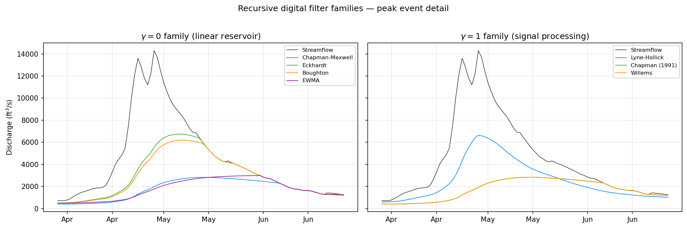

# Method Overview

pybaseflow implements 17 baseflow separation methods spanning four distinct paradigms. Before diving into the details of any individual method, it is worth understanding how these approaches relate to one another and what structural assumptions distinguish them. This page provides that orientation.

## The generalized recursive digital filter

The majority of methods in pybaseflow belong to the recursive digital filter family. Despite their apparent diversity -- different authors, different derivations, different parameter names -- all of these filters can be written as special cases of a single generalized equation:

$$b_t = \alpha \, b_{t-1} + \beta \left( Q_t + \gamma \, Q_{t-1} \right)$$

subject to the physical constraint \(b_t \leq Q_t\). Here \(b_t\) is the baseflow at timestep \(t\), \(Q_t\) is the total streamflow, and \(\alpha\), \(\beta\), \(\gamma\) are coefficients that encode the filter's behavior. The value of \(\gamma\) splits the filter family into two structurally distinct branches.

## The gamma = 0 family: linear reservoir filters

When \(\gamma = 0\), the filter update depends only on the previous baseflow and the current streamflow. These methods descend from linear reservoir theory, in which the aquifer is modeled as a storage element whose outflow is proportional to its volume. The Chapman-Maxwell, Eckhardt, Boughton, EWMA, and Furey-Gupta filters all belong to this family. They differ only in how \(\alpha\) and \(\beta\) are expressed in terms of their native parameters (recession coefficient, BFImax, and so on). The WHAT web tool is mathematically identical to the Eckhardt filter.

## The gamma = 1 family: signal-processing filters

When \(\gamma = 1\), the filter incorporates both the current and previous streamflow in each update, introducing a symmetric differencing that provides additional smoothing. These methods have their roots in digital signal processing rather than reservoir theory. The Lyne-Hollick filter, Chapman (1991) filter, and Willems filter belong to this branch. The Lyne-Hollick filter, typically applied in two or three forward-backward passes, is perhaps the most widely used baseflow separation tool in practice and serves as the default baseline in many comparative studies.

The IHACRES filter generalizes further by allowing \(\gamma\) to take any value, bridging the two families along a continuum. When its \(\alpha_s\) parameter is set to zero it reduces exactly to the Boughton filter; as \(\alpha_s\) moves toward 1.0 it approaches the signal-processing family.

## Graphical and recession-based methods

The second paradigm abandons recursive filtering entirely. Instead, these methods identify specific points in the hydrograph that are assumed to represent baseflow and construct the baseflow hydrograph by interpolating between them.

The three HYSEP methods (Sloto & Crouse, 1996) -- fixed interval, sliding interval, and local minimum -- partition the hydrograph into windows whose size depends on drainage area. The fixed and sliding interval methods assign the minimum discharge within each window as the baseflow level. The local minimum method identifies turning points and connects them with linear interpolation. The UKIH smoothed minima method (Institute of Hydrology, 1980) follows a similar logic but uses a five-day block minimum with a 90% screening criterion to identify turning points.

PART (Rutledge, 1998) is a recession-based method that identifies days meeting an antecedent recession requirement -- days preceded by a sustained decline in discharge -- and designates those as baseflow days. Between qualifying days, the baseflow hydrograph is interpolated in log-space. PART is widely used in USGS practice and is one of the standard tools distributed with USGS groundwater recharge estimation software.

## Tracer-based methods

The fourth paradigm uses water-quality observations as an independent constraint. The Conductivity Mass Balance (CMB) method applies a two-component mixing model using specific conductance as a conservative tracer. Where digital filters infer baseflow from the hydrograph shape alone, CMB leverages the geochemical contrast between dilute surface runoff and mineralized groundwater to physically partition the streamflow. CMB can also serve as a calibration reference for the Eckhardt filter, providing a physically grounded estimate of \(\text{BFI}_\text{max}\) for sites with concurrent SC data.

## Choosing a method

No single method is universally "best." The recursive digital filters are the simplest to apply and require only a streamflow time series, but their results depend on parameter choices that may not be independently verifiable. The graphical methods avoid the parameter sensitivity issue but produce coarser separations that may miss intra-event baseflow dynamics. PART requires drainage area but no other calibration. CMB requires specific conductance data and works best in catchments with a strong inverse Q-SC relationship.

In practice, running several methods and comparing their BFI estimates is a useful diagnostic. If multiple independent approaches converge on a similar baseflow fraction, confidence in the result is strengthened. If they diverge, the discrepancy itself is informative -- it may point to parameter miscalibration, violation of a method's assumptions, or genuine hydrological complexity that a single-method analysis would miss.

