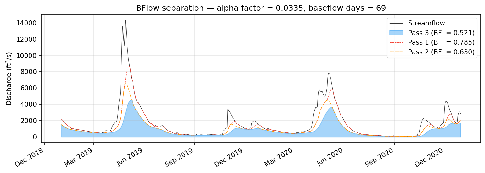
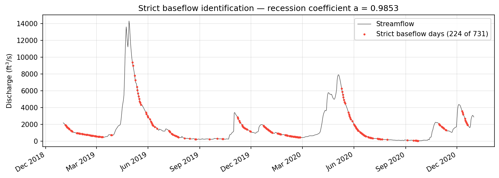

# Recession Analysis: BFlow and Brutsaert-Nieber

Recession analysis provides the foundation for parameterizing baseflow separation filters and for understanding the hydraulic properties of the aquifer system feeding a stream. This page covers two complementary approaches implemented in pybaseflow: the BFlow automated recession analysis of Arnold & Allen (1999), which estimates the SWAT alpha factor from declining baseflow segments, and the Brutsaert-Nieber (bn77) drought flow identification of Cheng et al. (2016), which isolates pure baseflow points through a rigorous set of elimination criteria. It also covers the `strict_baseflow()` heuristic, which identifies recession-dominated periods for recession coefficient estimation.

## BFlow: automated baseflow separation and recession analysis

The BFlow method, introduced by Arnold & Allen (1999) for use with the SWAT hydrological model, combines a well-known digital filter with an automated recession analysis. The filtering component is identical to the three-pass Lyne-Hollick filter -- there is no novelty in the separation itself. What BFlow contributes is a systematic procedure for extracting the exponential recession constant (SWAT's `ALPHA_BF` parameter) directly from the separated baseflow hydrograph.

### The recession analysis procedure

After the three-pass Lyne-Hollick filter produces a baseflow time series, BFlow identifies segments where baseflow is continuously declining. These recession segments represent periods when the stream is draining stored groundwater without significant new recharge, and the rate of decline carries information about the aquifer's hydraulic diffusivity.

Within each recession segment, the baseflow is modeled as an exponential decay:

$$Q_b(t) = Q_b(0) \cdot e^{-\alpha \, t}$$

where \(\alpha\) is the recession constant (the alpha factor) and \(t\) is time in days measured from the start of the segment. Taking the natural logarithm linearizes the relationship:

$$\ln Q_b(t) = \ln Q_b(0) - \alpha \, t$$

The implementation assembles a master recession curve by normalizing each segment so that it begins at \(t = 0\) and \(\ln Q_b = 0\), then fits a single slope \(\alpha\) across all segments via least-squares regression. This pooling strategy, rather than fitting each segment independently and averaging, gives more weight to longer and better-defined recessions.

From the fitted \(\alpha\), the number of baseflow days -- defined as the time required for baseflow to decline by one log cycle (a factor of 10) -- is computed as:

$$\text{BF}_\text{days} = \frac{\ln 10}{\alpha}$$

Streams with large, transmissive aquifers will have small \(\alpha\) values and correspondingly long baseflow recession periods, while flashy streams underlain by thin soils or impervious bedrock will exhibit large \(\alpha\) and short baseflow durations.

### Using bflow()

The `bflow()` function runs the complete procedure -- three-pass Lyne-Hollick separation followed by recession analysis -- and returns a dictionary containing both the baseflow time series and the recession diagnostics:

```python
from pybaseflow.estimate import bflow

result = bflow(Q, beta=0.925)

b = result['baseflow']            # daily baseflow array (3-pass LH)
alpha = result['alpha_factor']    # exponential recession constant
bf_days = result['baseflow_days'] # days per log cycle of recession
n_seg = result['n_segments']      # number of recession segments used
bfi = result['BFI']               # baseflow index from 3-pass filter
bfi1 = result['BFI_pass1']        # BFI from pass 1 only
bfi2 = result['BFI_pass2']        # BFI from passes 1-2
```

The `beta` parameter controls the Lyne-Hollick filter and defaults to 0.925 following Nathan & McMahon (1990). The recession analysis requires a minimum segment length of 10 days and a maximum of 300 days; segments outside this range are discarded. If no qualifying segments are found, the recession diagnostics are returned as NaN.



The BFI values reported for each pass illustrate a characteristic pattern: each successive pass of the Lyne-Hollick filter removes more quickflow, so `BFI_pass1` is the largest and `BFI` (the three-pass result) is the smallest. The progressive reduction gives a sense of how much of the hydrograph's variability is attributable to short-term storm response versus sustained groundwater discharge.

## Brutsaert-Nieber drought flow identification (bn77)

Where BFlow works backward from a filtered baseflow hydrograph, the Brutsaert-Nieber approach works forward from the raw discharge record. The method, as automated by Cheng et al. (2016), identifies individual data points that are unambiguously part of the aquifer's drought recession curve -- pure baseflow with no storm influence. These points can then be used for aquifer characterization, recession curve fitting, or as calibration targets for other separation methods.

### Recession slope analysis

The procedure begins by estimating the recession slope at each timestep using a centered finite difference:

$$S(t) = \frac{Q(t-1) - Q(t+1)}{2}$$

Positive values of \(S\) indicate declining discharge (recession), while negative or zero values indicate rising or constant flow. The algorithm identifies contiguous episodes where \(S > 0\) for at least `L_min` consecutive timesteps; these are the preliminary recession episodes.

### Elimination criteria

The raw recession episodes inevitably contain points contaminated by storm tails, snowmelt artifacts, measurement noise, or other non-baseflow influences. Cheng et al. (2016) defined a series of elimination criteria (labeled C3 through C9 in the original paper) that progressively strip away questionable points:

Criteria C3 and C4 remove the opening points of each recession episode. If the episode begins above a major-event threshold (defined by a quantile of the discharge distribution, default 90th percentile), the first three points are removed (C4); otherwise the first two are removed (C3). This accounts for the transition period at the start of a recession, during which surface runoff and interflow are still contributing to the hydrograph and the flow has not yet reached a state dominated by aquifer drainage.

Criterion C5 removes the last point of each episode, where the recession may be truncated by the onset of the next storm event and the finite-difference slope estimate is unreliable.

Criterion C6 targets abrupt changes in the recession rate by removing any point where the ratio \(S(t) / S(t-1) \geq 2\). Such jumps are inconsistent with the smooth exponential or power-law recession expected from aquifer drainage and typically indicate contamination by a brief rainfall pulse or data artifact.

Criterion C7 enforces monotonic decay in the recession slope itself: if \(S(t) < S(t+1)\), the point is removed. Under theoretical aquifer recession, the rate of decline should decrease over time as the hydraulic gradient flattens; a reversal suggests external influence.

Criterion C8 removes points falling within a user-specified snow/freeze period, during which the relationship between measured discharge and groundwater drainage may be distorted by ice formation, snowpack storage, or rapid melt events.

Criterion C9 removes points where the discharge falls below a specified observational precision threshold, below which measurement uncertainty dominates the signal.

### Using bn77()

```python
from pybaseflow.separation import bn77

drought_points = bn77(
    Q,
    L_min=10,                         # minimum recession episode length (days)
    snow_freeze_period=(335, 90),      # day-of-year range for snow/freeze
    observational_precision=0.01,      # minimum Q threshold
    quantile=0.9                       # percentile for major event detection
)
```

The function returns a NumPy array of indices into the original discharge array. These indices identify the surviving drought flow points -- the subset of the record that the algorithm considers to be uncontaminated aquifer recession. Typical applications include fitting the Brutsaert-Nieber recession equation \(-dQ/dt = aQ^b\) to characterize aquifer nonlinearity, or simply verifying that a digital filter's baseflow track passes through these physically identified baseflow points.

## Strict baseflow identification

The `strict_baseflow()` function provides a lighter-weight alternative for identifying recession-dominated periods. Rather than the full Brutsaert-Nieber elimination cascade, it applies a set of heuristic rules based on the hydrograph derivative to flag timesteps that are unambiguously part of a baseflow recession.

The function removes four categories of non-baseflow points. First, all timesteps where the centered derivative \(dQ/dt \geq 0\) (the hydrograph is rising or flat) are excluded. Second, a buffer zone around each rising limb is removed: two points before the start and three points after the end of each rising period. Third, five points following any major flow event (defined by the `quantile` parameter, default 0.9) are excluded to avoid the rapid recession immediately after a peak, which is dominated by quickflow rather than baseflow. Fourth, points where the recession is accelerating -- that is, where the second derivative of Q is negative -- are removed, since pure aquifer drainage should exhibit a decelerating recession.

```python
from pybaseflow.separation import strict_baseflow

strict = strict_baseflow(Q, quantile=0.9)
# strict is a boolean array: True = strict baseflow day
```

The primary use of `strict_baseflow()` is as input to `recession_coefficient()`, which fits the recession constant from the identified baseflow periods. Together, these two functions form the standard workflow for estimating the recession parameter needed by most digital filters in pybaseflow.



An optional `ice` argument accepts a boolean mask for ice-affected periods, which are excluded from the strict baseflow designation. This is useful for high-latitude or high-elevation catchments where winter discharge records may be unreliable.

## References

Arnold, J.G. and Allen, P.M. (1999) Automated methods for estimating baseflow and ground water recharge from streamflow records. *Journal of the American Water Resources Association* 35(2), 411--424.

Cheng, L., Zhang, L. and Brutsaert, W. (2016) Automated selection of pure base flows from regular daily streamflow data: objective algorithm. *Journal of Hydrologic Engineering* 21(11), 06016008.

Nathan, R.J. and McMahon, T.A. (1990) Evaluation of automated techniques for base flow and recession analyses. *Water Resources Research* 26(7), 1465--1473.
