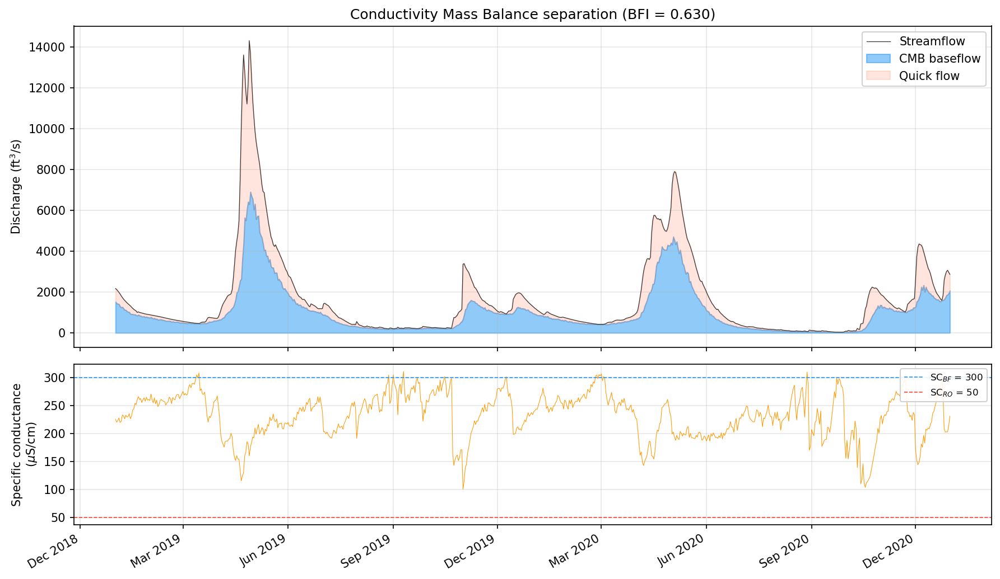

# Tracer-Based Methods: Conductivity Mass Balance

Tracer-based baseflow separation represents a fundamentally different paradigm from digital filtering. Rather than inferring the slow-flow component from the shape of the hydrograph alone, the Conductivity Mass Balance (CMB) method exploits the geochemical contrast between groundwater and surface runoff to physically partition streamflow into its source components. The underlying assumption is straightforward: groundwater that has percolated through soil and rock acquires dissolved minerals, elevating its specific conductance (SC), while recent precipitation and overland flow remain comparatively dilute.

## Theoretical basis

CMB rests on simultaneous conservation of water mass and solute mass at the stream cross-section. At each timestep the total discharge \(Q\) is the sum of a baseflow component \(Q_b\) and a surface runoff component \(Q_r\):

$$Q(t) = Q_b(t) + Q_r(t)$$

If specific conductance behaves as a conservative tracer -- that is, it mixes linearly and is neither produced nor consumed in the channel -- then the solute balance is:

$$Q(t) \cdot SC(t) = Q_b(t) \cdot SC_{BF} + Q_r(t) \cdot SC_{RO}$$

where \(SC_{BF}\) is the end-member conductivity of baseflow and \(SC_{RO}\) is the end-member conductivity of surface runoff. Substituting the water balance into the solute balance and solving for baseflow yields:

$$Q_b(t) = Q(t) \cdot \frac{SC(t) - SC_{RO}}{SC_{BF} - SC_{RO}}$$

This is the core CMB equation. It produces a baseflow estimate at every timestep where both \(Q\) and \(SC\) are available, without any need for filter calibration, recession analysis, or tuning parameters in the traditional sense. The separation is driven entirely by the observed chemistry.

## End-member estimation

The practical challenge lies in choosing appropriate values for the two end-member conductivities. In the absence of direct well sampling or event-based monitoring, baseflowx estimates them from the statistical distribution of the SC record itself. The rationale is that the highest conductance values in the record correspond to periods when streamflow is almost entirely groundwater, while the lowest values correspond to storm peaks dominated by fresh precipitation.

The `estimate_endmembers()` function computes \(SC_{BF}\) as the 99th percentile of the observed SC series and \(SC_{RO}\) as the 1st percentile:

```python
from baseflowx.tracer import estimate_endmembers

SC_BF, SC_RO = estimate_endmembers(SC, bf_percentile=99, ro_percentile=1)
```

Using extreme percentiles rather than the absolute maximum and minimum avoids undue influence from outliers -- a single anomalous SC reading from instrument error or an unusual pollution event would distort an end-member estimate based on the raw extremum. The percentile thresholds can be adjusted via the `bf_percentile` and `ro_percentile` arguments if site conditions warrant it.

It is worth noting that the separation is considerably more sensitive to errors in \(SC_{BF}\) than to errors in \(SC_{RO}\). Because \(SC_{BF}\) appears in the denominator of the mixing equation and typically sits close to the observed SC during low-flow periods, even modest changes in its value can shift the computed baseflow fraction substantially. The runoff end-member, by contrast, exerts a weaker influence because it is subtracted in the numerator and is usually much smaller than the ambient SC. Stewart et al. (2007) noted this asymmetry and recommended careful attention to the baseflow end-member in particular.

## Running CMB

The `cmb()` function accepts streamflow and specific conductance arrays and returns a daily baseflow time series:

```python
import numpy as np
from baseflowx.tracer import cmb

# Q and SC are numpy arrays of the same length
b = cmb(Q, SC)
```

If you have independent estimates of the end-members (e.g., from well samples or synoptic surveys), you can supply them directly:

```python
b = cmb(Q, SC, SC_BF=450.0, SC_RO=25.0)
```

The function applies physical constraints after solving the mixing equation: computed baseflow is clipped to the interval \([0, Q(t)]\) at each timestep, ensuring that baseflow never goes negative or exceeds total discharge. Timesteps where SC is missing (NaN) propagate as NaN in the output.



## When CMB works well -- and when it does not

CMB performs best when the geochemical contrast between groundwater and surface water is strong and consistent. Ideal conditions include headwater catchments underlain by carbonate or other soluble geology, where the inverse correlation between discharge and specific conductance is pronounced. In such settings the two-component mixing model is a reasonable approximation of reality, and CMB can provide a physically grounded separation that serves as an independent check on filter-based methods.

The method becomes less reliable under several circumstances. Anthropogenic point sources -- wastewater treatment plants, road salt applications, industrial discharges -- can introduce high-conductance water that is not groundwater, violating the assumption that elevated SC implies baseflow. Reservoirs and impoundments disrupt the natural Q-SC relationship by storing and releasing water on schedules unrelated to the local water balance. In large catchments with heterogeneous geology, the assumption of a single pair of end-members may be too simplistic; different tributaries may contribute groundwater with very different conductivities, and the effective \(SC_{BF}\) becomes a moving target that varies with antecedent conditions and the spatial pattern of recharge.

Seasonal variation in end-members is another potential complication. In regions with strong seasonality, the conductance of shallow groundwater may shift between summer and winter as evapotranspiration concentrates solutes or snowmelt dilutes them. The percentile-based estimation treats the entire record as stationary, which may introduce bias if the SC distribution has substantial seasonal structure.

## Calibrating Eckhardt from CMB

One of the most valuable applications of CMB is not as a standalone separation method but as a calibration target for the Eckhardt filter. Many streamflow records have continuous discharge data spanning decades but only a limited window of concurrent SC measurements. The `calibrate_eckhardt_from_cmb()` function bridges this gap: it runs CMB over the period where both Q and SC are available, computes the resulting BFI, and returns a \(\text{BFI}_\text{max}\) value that can then be used with the Eckhardt filter on the full discharge record.

```python
from baseflowx.tracer import calibrate_eckhardt_from_cmb

result = calibrate_eckhardt_from_cmb(Q, SC)

# result is a dict with keys:
#   'BFImax'  - calibrated maximum baseflow index
#   'BFI_cmb' - BFI computed from CMB
#   'a'       - recession coefficient used
#   'SC_BF'   - baseflow end-member conductivity
#   'SC_RO'   - runoff end-member conductivity
```

If a recession coefficient is not supplied, the function estimates one internally using `strict_baseflow()` and `recession_coefficient()`. The typical workflow proceeds as follows: obtain a few years of concurrent Q and SC data, run the calibration to determine \(\text{BFI}_\text{max}\), then apply the Eckhardt filter to the full multi-decade discharge record using that calibrated parameter. This approach combines the physical grounding of the tracer method with the temporal coverage of the digital filter.

## References

Stewart, M.T., Cimino, J. and Ross, M. (2007) Calibration of base flow separation methods with streamflow conductivity. *Groundwater* 45(1), 17--27.

Eckhardt, K. (2005) How to construct recursive digital filters for baseflow separation. *Hydrological Processes* 19, 507--515.
